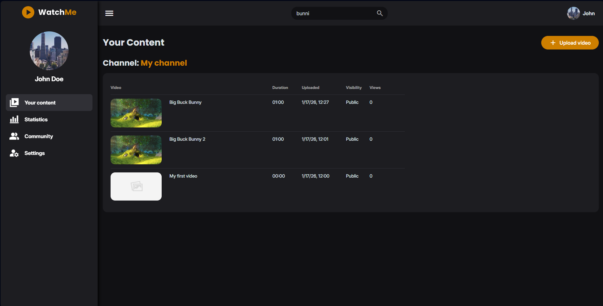
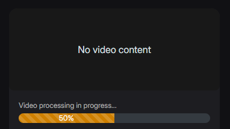
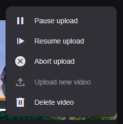
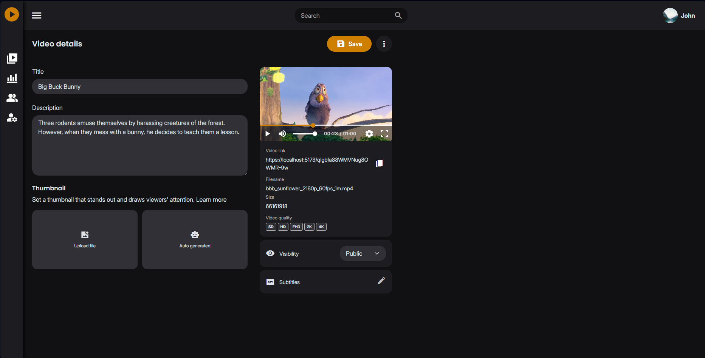
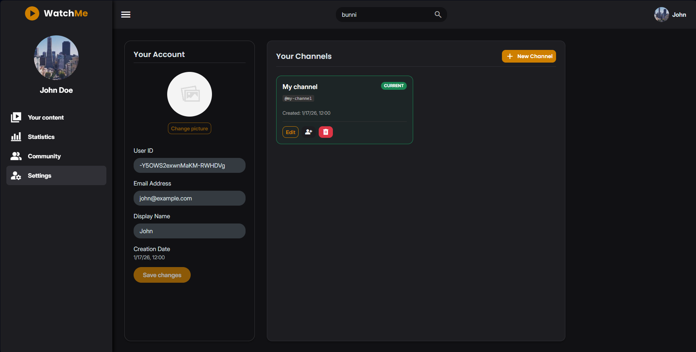
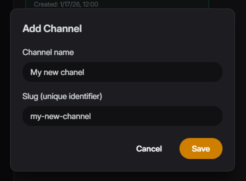
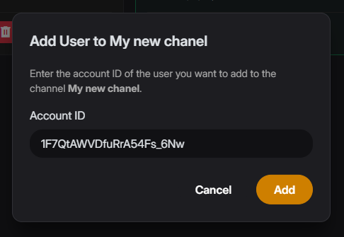

## Studio (Content Creators)

The Studio is a dedicated area for managing your videos, channels, and account settings. Access it via **Your Content** in the Profile Menu.

### Dashboard (Your Content)

This is your command center.

- **Video List:** View all your uploaded videos.

- **Upload:** Click the **Upload video** button to add new content.
  - **Desktop:** Opens a popup to select files.

  - **Mobile:** Opens the device file picker.

_Studio Your Content Dashboard_

### Uploading & Editing Videos

When you upload a video or click on an existing one, you enter the Edit Video mode.

#### Edit Video Details

- **Title:** specific title for your video.

- **Description:** detailed description.

- **Thumbnail:** Manage how your video appears in feeds.

#### Processing

While the video is being encoded on the server, a progress bar will be displayed to indicate the current status.

_Server-side video processing progress_

#### Actions

- **Save:** Persist your changes.

- **Upload Controls:** Use the context menu to pause, resume, or abort an ongoing upload.

* **Delete:** Permanently remove the video.

  
_Upload Management Menu (Pause, Resume, Abort)_

_Edit Video Page_

### Account & Channel Settings

Manage your identity and channels under the **Account Settings** tab in the Studio sidebar.

#### User Profile

- View your **User ID**, **Email**, **Display Name**, and **Creation Date**.
- (Future) Options to change your profile picture.

_Account Settings Page_

#### Channel Management

- **Your Channels:** View a list of channels you own.

- **New Channel:** Create a new channel to publish content under a different brand/theme.

_Add New Channel Popup_

- **Edit Channel:** Update channel details.

- **Manage Users:** Link other users to manage your channel. Use the "Add User" popup to grant access to other accounts.

_Add User to Channel Popup_

- **Delete Channel:** Remove a channel and its content.
