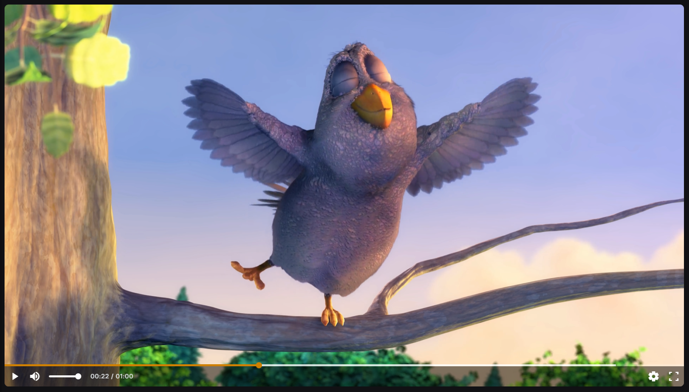
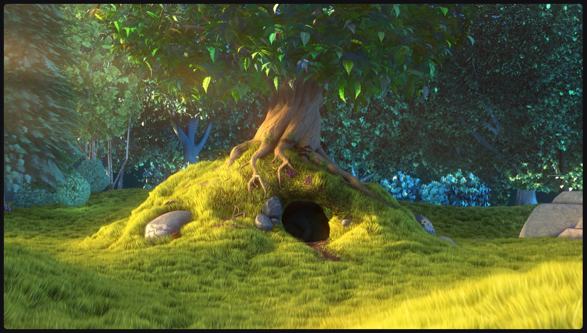
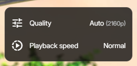
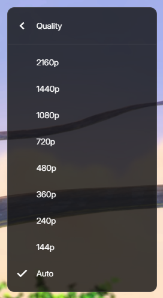
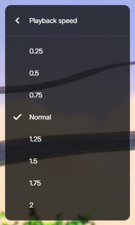

# Player

The video player provides a set of on-screen controls that allow users to manage playback, video quality,
and viewing preferences. These options are accessible directly from the player interface.

To provide an unobstructed viewing experience, the video player automatically hides the on-screen controls during playback.
When the video is playing and there is no mouse movement, all on-screen controls fade out after a short delay.
Move the mouse anywhere over the video player to make the controls reappear.

> The controls remain visible while the video is paused or when the mouse cursor is actively moving over the player.

## Playback control

### Play / Pause

Starts or pauses video playback.

### Current time indicator

Shows the elapsed playback time and the total length of the video.

### Video scrubber

The video player includes a scrubber preview that helps users navigate the video timeline more precisely.
When hovering the mouse over the seek bar (timeline), a thumbnail image appears above the scrubber.
The thumbnail represents the video frame at the current hover position.
As the user moves the cursor along the seek bar, the preview image updates in real time to match the corresponding timestamp.

## Volume control

Allows users to mute/unmute audio and adjust volume level.

## Fullscreen toggle

Expands the video to fullscreen mode or exits fullscreen.

## Settings

Opens additional playback configuration options, including quality and playback speed.

### Video quality selection

The Quality menu allows users to manually select the video resolution or let the player adjust automatically.
The "Auto" option Automatically selects the best quality based on network conditions and device performance.

> Available resolutions depend on the uploaded video and the viewer’s device capabilities.

### Playback speed

The Playback Speed menu allows users to control how fast or slow the video plays.

