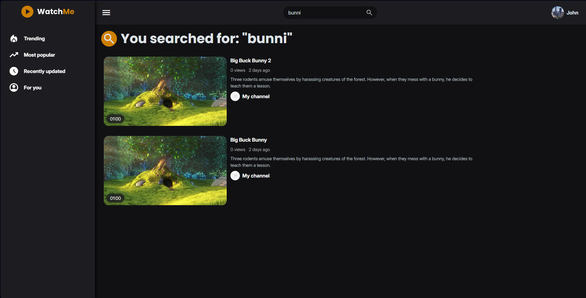
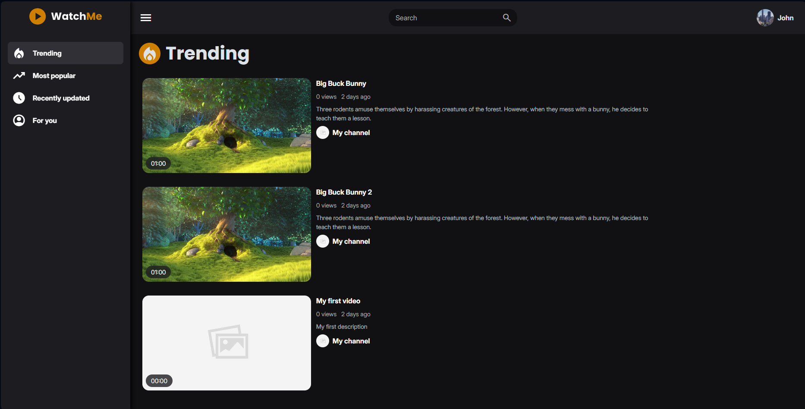
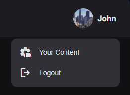
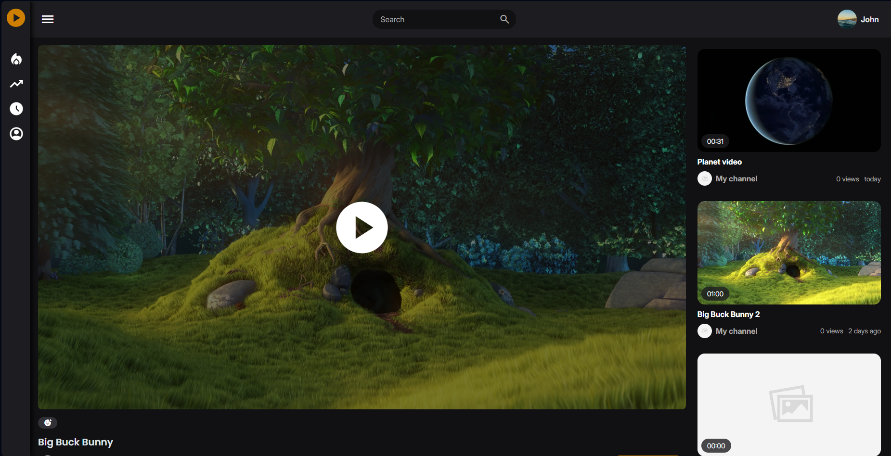
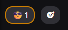
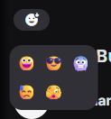
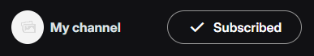
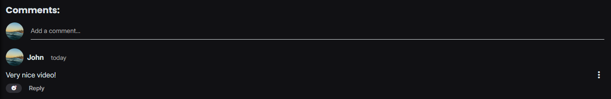
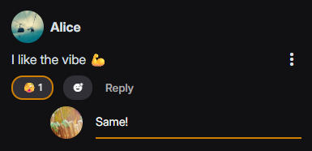
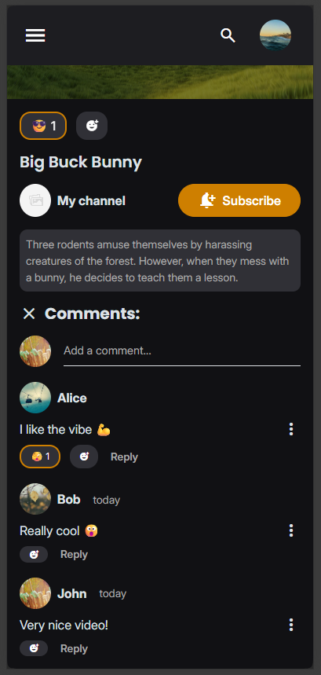

## Main Interface

The application interface consists of a persistent header and sidebar for easy navigation.

### Header

The header provides quick access to key features:

- **Menu Button:** Toggles the sidebar visibility.
- **Search Bar:** Search for videos by title or keywords.
- **Profile Menu:** Access user-specific actions.

_Search page results_

### Sidebar

The sidebar allows you to switch between different video feeds:

- **Trending:** See what's currently popular.
- **Most Popular:** View all-time hits.
- **Recently Uploaded:** Browse the newest content.
- **For You:** Personalized recommendations.

_Sidebar Navigation (visible on the left)_

### User Menu (Profile Dropdown)

Located in the top-right corner:

- **Guest:** Shows a **Login** option.
- **Logged In:**
  - **Your Content:** Navigates to the Studio dashboard.
  - **Logout:** Signs you out of the application.

  
_User Profile Menu_

## Browsing & Watching

### Video Feeds

Browse videos through the various feeds available in the sidebar. Click on any video thumbnail to start watching.

_Trending Video Feed_

### Watch Page

The Watch Page is where you view content.

_Watch Page Overview_

#### Video Player

- **Playback Controls:** Play, pause, adjust volume, and seek through the video.

- **Quality:** The player automatically adapts streaming quality (HLS).

#### Video Information & Actions

Below the player, you can:

- **View Details:** See the video title, description, and channel information.

- **React:** Use emojis to react to the video.

_Video Interaction Area_

_Reactions picker_

- **Subscribe:** Click the **Subscribe** button to follow the channel.

_Subscribed channel_

#### Comments

- **View Comments:** Read what others are saying below the video.

- **Add Comment:** Logged-in users can post new comments.

_Comments Section_

- **Reply to Comments:** Engage in discussions by replying to specific comments.

_Replying to a Comment_

- **Mobile View:** On mobile devices, comments are optimized for smaller screens.

_Comments on Mobile_

#### Recommended Videos

A list of recommended videos appears in the sidebar (or below the video on mobile) for continuous viewing.
